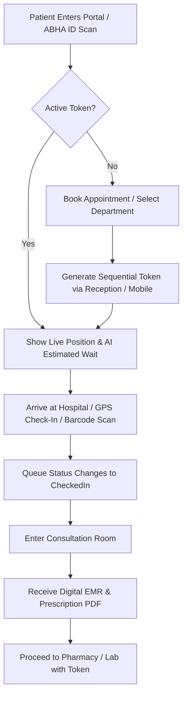
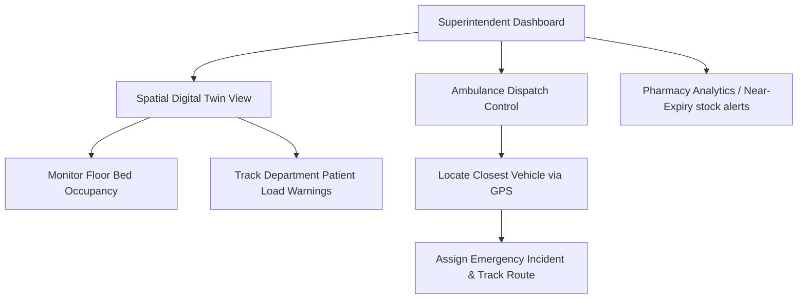
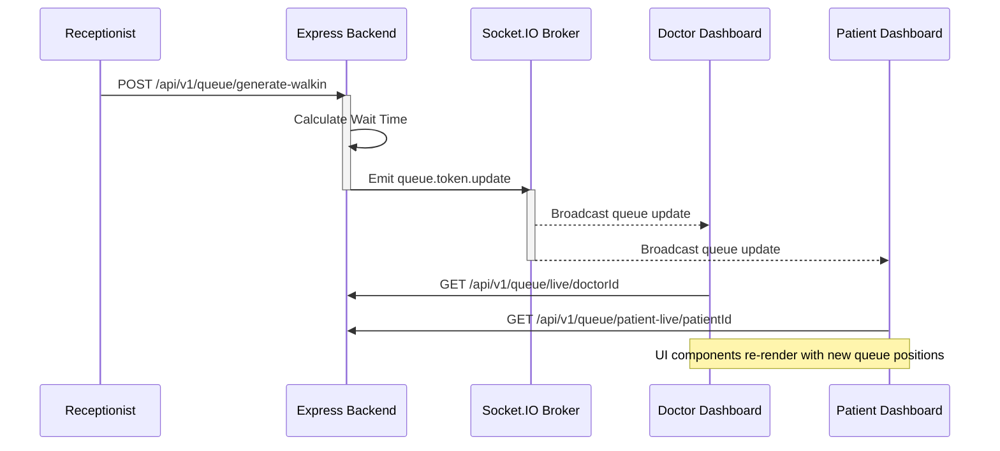
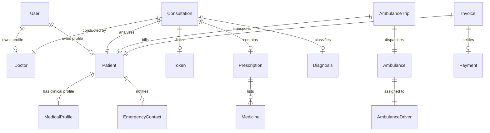
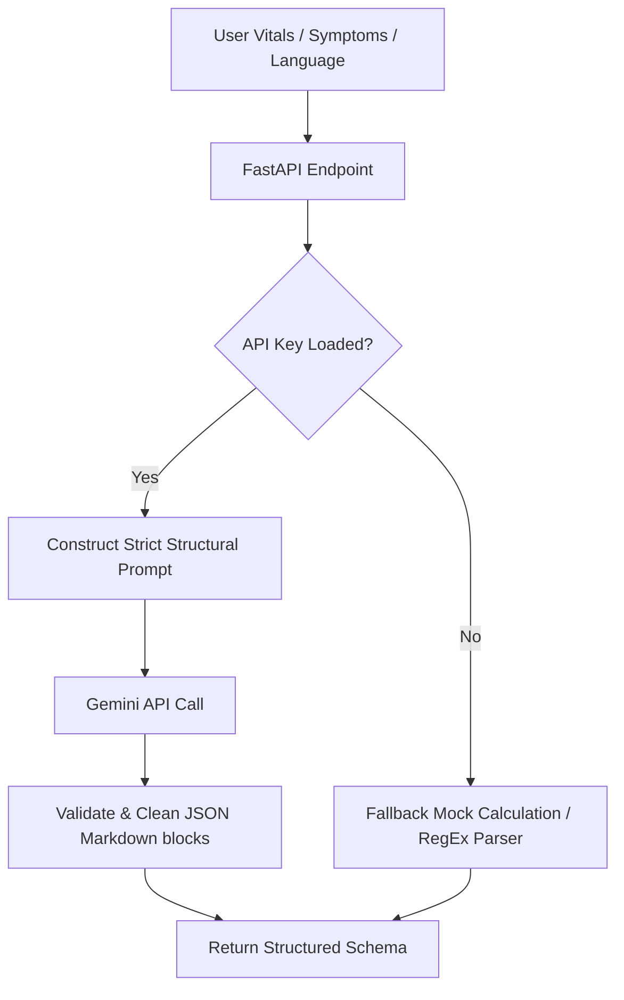

# 🏥 ArogyaMitra (आरोग्यमित्र)
# deployment https://ps-1-gdgnagpur-codevians-o2t4.vercel.app

> **Futuristic AI-Powered Queue, Resource, & Emergency Management Platform for Government & Public Hospitals**

[](LICENSE)
[](https://nextjs.org/)
[](https://fastapi.tiangolo.com/)
[](https://expressjs.com/)
[](https://www.mongodb.com/)
[](#docker)
[](https://ai.google.dev/)

ArogyaMitra is a comprehensive, production-ready healthcare automation suite designed to transform overcrowded public health facilities, Primary Health Centres (PHCs), and district hospitals into smart, real-time coordinated ecosystems. By replacing traditional physical lines with dynamic AI queue scheduling, automatic EMR indexing, telemedicine, real-time bed tracking, smart ambulance dispatching, and a spatial digital twin, ArogyaMitra addresses the critical pain points of accessibility, resource allocation, and administrative overhead.

---

## 📖 Table of Contents

- [🏥 ArogyaMitra (आरोग्यमित्र)](#-arogyamitra-आरोग्यमित्र)
  - [📖 Table of Contents](#-table-of-contents)
  - [🚨 Problem Statement](#-problem-statement)
  - [💡 The Solution](#-the-solution)
  - [🩺 Workflows \& Lifecycles](#-workflows--lifecycles)
    - [1. Patient Journey](#1-patient-journey)
    - [2. Doctor Consultation Workflow](#2-doctor-consultation-workflow)
    - [3. Hospital Administration Workflow](#3-hospital-administration-workflow)
  - [✨ Feature Inventory \& Status](#-feature-inventory--status)
  - [🏗️ System Architecture](#️-system-architecture)
    - [1. System Topology](#1-system-topology)
    - [2. Live Queue Sync Flow](#2-live-queue-sync-flow)
    - [3. Database Schema Entity Relationships](#3-database-schema-entity-relationships)
    - [4. AI Inference Pipeline](#4-ai-inference-pipeline)
  - [⚙️ Technology Stack](#️-technology-stack)
    - [Frontend System](#frontend-system)
    - [Backend API Services](#backend-api-services)
    - [AI \& ML Infrastructure](#ai--ml-infrastructure)
  - [📂 Directory Structure](#-directory-structure)
  - [🔑 Environment Variables](#-environment-variables)
    - [Express Backend (`backend/.env`)](#express-backend-backendenv)
    - [AI FastAPI Service (`ai_service/.env`)](#ai-fastapi-service-ai_serviceenv)
    - [Next.js Frontend (`frontend/.env.local`)](#next-js-frontend-frontendenvlocal)
  - [🔌 API Endpoint Catalog](#-api-endpoint-catalog)
  - [💾 Database Design \& Entities](#-database-design--entities)
  - [🛡️ Security \& Compliance](#️-security--compliance)
  - [🚀 Performance Optimizations](#-performance-optimizations)
  - [♿ Accessibility (a11y) \& UI/UX Standards](#-accessibility-a11y--uiux-standards)
  - [📈 Scalability Roadmap](#-scalability-roadmap)
  - [🇮🇳 Government Initiatives Alignment](#-government-initiatives-alignment)
  - [🛠️ Installation \& Local Development](#️-installation--local-development)
    - [Quick Start script (Automated)](#quick-start-script-automated)
    - [Manual Step-by-Step Configuration](#manual-step-by-step-configuration)
    - [Running with Docker Compose](#running-with-docker-compose)
  - [👥 Seed Credentials for Testing](#-seed-credentials-for-testing)
  - [📝 License](#-license)

---

## 🚨 Problem Statement

Public and government healthcare facilities in emerging regions face structural gridlocks:
1. **Extreme Waiting Times & Overcrowding**: Patients wait hours in physical corridors for consultations, leading to chaotic crowd sizes and high infection transmission risks.
2. **Rural Accessibility Barriers**: Patients travel long distances from villages to clinics without knowing if specialists are active, leading to wasted expenses.
3. **Severe Resource & Medicine Scarcity**: Lack of real-time inventory tracking leads to stock-outs of vital medicines and unmanaged emergency bed availability.
4. **Administrative Fatigue**: Doctors are buried under manual paperwork, reducing actual clinical assessment quality and patient throughput.
5. **Disconnected Registries**: No standardized method exists to audit operational compliance or coordinate multi-hospital public health responses.

---

## 💡 The Solution

ArogyaMitra digitizes the clinical loop into a unified, responsive interface:
- **Smart Token Scheduling**: Patient walk-ins get digital tokens via QR/ABHA lookup. Wait-times are predicted in real time using queue size and doctor assessment speed.
- **Dynamic Queue Reordering**: Critical triage entries, pregnant women, and senior citizens are automatically bumped to the front of queue timelines.
- **3D Spatial Digital Twin**: Real-time room loads, bed occupancies, and indoor navigation routes are visible on a live campus layout for administrators.
- **Embedded Clinical Assistant**: A clinical language engine analyzes vitals and symptoms to suggest differential diagnoses, medication safety audits, and investigational routes directly in the EMR.
- **Smart Dispatch Tracker**: Connects patients and emergency dispatchers with real-time GPS coordinates of the ambulance fleet.

---

## 🩺 Workflows & Lifecycles

### 1. Patient Journey



### 2. Doctor Consultation Workflow

```mermaid
graph LR
    A["Doctor Logs In"] --> B["Set Status: Available"]
    B --> C["Fetch Live Queue"]
    C --> D["Click Call Next"]
    D --> E["Activate consultation/visitId"]
    E --> F["EMR Assistant Panel: Vitals, Allergies & History"]
    F --> G["Draft Prescriptions & Select Lab Orders"]
    G --> H["Clinical AI Safety Audit: Drug Interaction Check"]
    H --> I["Complete Consultation & Generate Invoice"]
```



### 3. Hospital Administration Workflow



---

## ✨ Feature Inventory & Status

| Module | Feature Description | Core User | Value Added | Implementation Status |
| :--- | :--- | :--- | :--- | :---: |
| **Auth** | Role-Based Access Control & ABHA ID Linkage | All Users | High-security profile management | **Production Ready** |
| **Queue** | Real-time WebSocket token tracking | Patient / Doctor | Zero physical waiting lines | **Production Ready** |
| **Queue** | Priority/Emergency bypass injection | Reception / Doctor | Fast-tracked critical care | **Production Ready** |
| **Queue** | GPS and Barcode check-in validation | Patient / Staff | Prevents spoofing and manual errors | **Production Ready** |
| **EMR** | Multi-Specialty Consultation Station | Doctor | Standardized diagnostic entry | **Production Ready** |
| **AI Assistant** | Gemini clinical summarization & diagnoses | Doctor | Decreases cognitive load, flags risk | **Production Ready** |
| **AI Assistant** | Voice transcription & Indian language translation | Doctor / Patient | Removes regional language barriers | **Production Ready** |
| **Pharmacy** | Batch-tracked medicine catalog & supplier orders | Pharmacist | Prevents expired medicine output | **Production Ready** |
| **Pharmacy** | Automated Drug-to-Drug interaction warnings | Pharmacist / Doctor| Ensures safety prior to dispensing | **Production Ready** |
| **Diagnostics**| LIMS sample barcode checks & approvals | Lab Pathologist | Eliminates manual report mixups | **Production Ready** |
| **Diagnostics**| Diagnostic result attachment to EMR profile | Patient | Accessible lifetime health history | **Production Ready** |
| **Ambulance** | Real-time fleet tracking & OSM Routing | Dispatcher / Driver | Drastically reduces transit times | **Production Ready** |
| **Finance** | Invoicing, Razorpay integration, & Offline payments | Reception / Patient| Direct billing and fast settlements | **Production Ready** |
| **Twin** | Real-time 3D spatial twin and telemetry | Admin HQ | Full facility oversight & capacity audits | **Production Ready** |
| **State Admin**| Outbreak trackers & Policy compliance grids | State Health Admin| Epidemiological insight, audit trails | **Production Ready** |

---

## 🏗️ System Architecture

### 1. System Topology

```
                  +----------------------------------------+
                  |         Next.js Client (v14)           |
                  |   - Framer Motion UI Components        |
                  |   - Socket.IO Client Real-Time Sync    |
                  |   - Leaflet / Maplibre GL Rendering    |
                  +-------------------+--------------------+
                                      |
                             REST APIs / WebSockets
                                      |
                  +-------------------|--------------------+
                  |    Express Application Server (v5)     |
                  |   - JSON Web Token (JWT) Guard         |
                  |   - LiveKit Server Telemedicine Tokens |
                  |   - Razorpay Payment Integrations      |
                  +---------+--------------------+---------+
                            |                    |
                         DB I/O              HTTP API
                            |                    |
            +---------------+                +---+--------------------+
            | MongoDB Database Cluster       | FastAPI AI Agent (v1)  |
            | - Mongoose Schemas & Hooks     | - Gemini-3.5-Flash     |
            | - Transaction Auditing         | - Indian translation   |
            +------------------------------+ - Waiting Predictors    |
                                             +------------------------+
```

### 2. Live Queue Sync Flow



### 3. Database Schema Entity Relationships



### 4. AI Inference Pipeline



---

## ⚙️ Technology Stack

### Frontend System
* **Framework**: Next.js 14 (App Router)
* **Animation & Rendering**: GSAP, Framer Motion, Lenis Scroll
* **Interactive Maps**: Maplibre-gl (hospital live map coordinates), Leaflet & React-Leaflet (digital twin campus layout)
* **Telemedicine**: LiveKit Components React & Client SDK
* **Charts & Visuals**: Recharts (Consultation Analytics, Stock Levels)
* **Styling**: Tailwind CSS & Shadcn/UI (Vanilla CSS variables customized)

### Backend API Services
* **Engine**: Node.js & Express.js (v5)
* **Security & Tokens**: JWT & bcrypt
* **Real-time Sync**: Socket.io Server & Client
* **Database Driver**: Mongoose (MongoDB ODM)
* **Telemedicine Rooms**: LiveKit Server SDK
* **Payments Gateway**: Razorpay Node SDK

### AI & ML Infrastructure
* **Framework**: FastAPI (Python)
* **Agent Engine**: Google Gemini API Integration (`gemini-3.5-flash`)
* **Execution**: Uvicorn HTTP Server

---

## 📂 Directory Structure

```
arogyamitra/
├── ArogyaMitra/
│   ├── ai_service/                # Python AI/ML microservice
│   │   ├── app/
│   │   │   └── main.py            # FastAPI entrypoint & model routes
│   │   ├── Dockerfile
│   │   └── requirements.txt
│   ├── backend/                   # Node.js + Express backend service
│   │   ├── src/
│   │   │   ├── controllers/       # Route business logic handlers
│   │   │   ├── middlewares/       # Authentication & authorization checks
│   │   │   ├── models/            # 69 Mongoose Schemas & models
│   │   │   ├── routes/            # REST endpoint configurations
│   │   │   ├── services/          # Core modules (medication check, queue)
│   │   │   └── server.ts          # Server listener initialization
│   │   ├── Dockerfile
│   │   ├── seed-demo-users.js     # Master demo database seeder
│   │   └── tsconfig.json
│   ├── frontend/                  # Next.js 14 UI Portal
│   │   ├── public/
│   │   ├── src/
│   │   │   ├── app/               # Page routing & pages configuration
│   │   │   ├── components/        # Reusable dashboard widgets & digital twin views
│   │   │   ├── config/            # Map configurations & thresholds
│   │   │   ├── context/           # Socket connection providers
│   │   │   └── lib/               # Location helpers
│   │   ├── Dockerfile
│   │   ├── package.json
│   │   └── tailwind.config.ts
│   ├── docker-compose.yml         # Local container orchestration file
│   ├── start_local.sh             # automated developer quickstart script
│   └── start_project.sh           # startup chooser wrapper
```

---

## 🔑 Environment Variables

To run the platform, set the following configurations:

### Express Backend (`backend/.env`)
| Variable | Description | Example |
| :--- | :--- | :--- |
| `PORT` | Local server port for API | `5000` |
| `MONGO_URI` | MongoDB Connection String | `mongodb+srv://...` |
| `AI_SERVICE_URL` | Microservice URL for AI processing | `http://localhost:8000` |
| `JWT_SECRET` | Signature key for auth web tokens | `supersecretkey123` |
| `GEMINI_API_KEY` | Key for fallback LLM operations | `AIzaSy...` |
| `RAZORPAY_KEY_ID` | Razorpay Key ID for payments | `rzp_test_...` |
| `RAZORPAY_KEY_SECRET`| Razorpay Key Secret | `6W3ST...` |
| `LIVEKIT_URL` | LiveKit server socket endpoint | `wss://...` |
| `LIVEKIT_API_KEY` | LiveKit integration key | `API...` |
| `LIVEKIT_API_SECRET`| LiveKit secret key | `J1KaS...` |

### AI FastAPI Service (`ai_service/.env`)
| Variable | Description | Example |
| :--- | :--- | :--- |
| `GEMINI_API_KEY` | API Key for Google generative language | `AIzaSy...` |
| `GEMINI_MODEL` | Gemini Model version used | `gemini-3.5-flash` |

### Next.js Frontend (`frontend/.env.local`)
| Variable | Description | Example |
| :--- | :--- | :--- |
| `NEXT_PUBLIC_API_URL` | Express API endpoint | `http://localhost:5000/api/v1` |
| `NEXT_PUBLIC_AI_URL` | FastAPI AI Endpoint | `http://localhost:8000` |
| `NEXT_PUBLIC_RAZORPAY_KEY_ID`| Razorpay checkout script key | `rzp_test_...` |

---

## 🔌 API Endpoint Catalog

<details>
<summary>🔑 Authentication Routes (`/auth` Prefix)</summary>

| Method | Endpoint | Action Description | Auth Required |
| :--- | :--- | :--- | :--- |
| `POST` | `/register` | Sign up patient, doctor, staff or driver | None |
| `POST` | `/login` | Generate session JWT | None |
| `POST` | `/send-otp` | Initiate verification OTP via SMS | None |
| `POST` | `/verify-otp` | Check OTP code correctness | None |
| `POST` | `/verify-abha`| Validate national health card credentials | None |
| `GET` | `/patient/phone/:phone` | Fetch existing patient details by phone | Yes |

</details>

<details>
<summary>🩺 Queue & Token Management (`/queue` Prefix)</summary>

| Method | Endpoint | Action Description | Auth Required |
| :--- | :--- | :--- | :--- |
| `GET` | `/live/:doctorId` | Retrieve current queue list for a doctor | Yes |
| `POST` | `/generate-walkin`| Generate queue token for walk-in patient | Yes |
| `POST` | `/check-in` | Change patient status to CheckedIn | Yes |
| `POST` | `/checkin-barcode`| Confirm check-in using barcode scan | Yes |
| `POST` | `/next` | Advance doctor to the next waiting patient | Yes |
| `POST` | `/emergency` | Inject a priority emergency patient into the front | Yes |
| `POST` | `/skip` | Mark current patient as absent or skipped | Yes |
| `POST` | `/transfer` | Move patient queue token to another department | Yes |
| `POST` | `/pause` | Stop queue progress (doctor break) | Yes |

</details>

<details>
<summary>🚑 Ambulance fleet and Emergency Dispatch (`/ambulance` Prefix)</summary>

| Method | Endpoint | Action Description | Auth Required |
| :--- | :--- | :--- | :--- |
| `GET` | `/` | Fetch all ambulance entries in active fleet | Yes |
| `POST` | `/dispatch` | Initiate dispatch incident for emergency | Yes |
| `GET` | `/dispatch/nearest`| Locate nearest ambulance coordinates | Yes |
| `POST` | `/:id/gps` | Update current ambulance coordinates | Yes |
| `POST` | `/trip/:id/arrive-hospital` | Driver signals patient transport arrived | Yes |

</details>

<details>
<summary>💳 Billing & Payments (`/billing` Prefix)</summary>

| Method | Endpoint | Action Description | Auth Required |
| :--- | :--- | :--- | :--- |
| `GET` | `/pending-charges/:patientId` | View unpaid patient invoice fees | Yes |
| `POST` | `/invoices/generate` | Consolidate consultation, pharmacy and lab charges | Yes |
| `POST` | `/invoices/:invoiceId/pay/online` | Initialize Razorpay payment session | Yes |
| `POST` | `/invoices/:invoiceId/pay/offline` | Record Cash/UPI reception | Yes |

</details>

<details>
<summary>🔬 Laboratory LIMS (`/lab` Prefix)</summary>

| Method | Endpoint | Action Description | Auth Required |
| :--- | :--- | :--- | :--- |
| `GET` | `/dashboard` | View active samples and statuses | Yes |
| `POST` | `/collect` | Register sample vial collection | Yes |
| `POST` | `/submit-results`| Key in lab values & diagnostic outputs | Yes |
| `POST` | `/approve` | Verify report content (Pathologist signature) | Yes |

</details>

---

## 💾 Database Design & Entities

ArogyaMitra leverages MongoDB's document architecture to support complex health histories while ensuring high lookup performance:

1. **User Table**: Central credentials mapping role to `patient`, `doctor`, `admin`, `staff`, `lab`, `pharmacy`, or `driver`.
2. **Patient Table**: ABHA-linked record with auto-generating IDs (`PAT-YYYY-XXXXXX`) and auto-calculated age hooks.
3. **MedicalProfile**: Linked via `patient_id` containing allergies, active diseases, and current medications.
4. **Token**: Records queue sequence number, display token (e.g. `CARD-105`), status, and estimated wait minutes.
5. **Ambulance & AmbulanceTrip**: Stores telemetry, vehicle status (`Available`, `EnRoute`, `Transporting`), and route coordinates.
6. **Visit & Consultation**: Links patient, doctor, clinical notes, and ICD-10 diagnostic codes.

---

## 🛡️ Security & Compliance

* **Access Control**: Role-Based Authorization restricts administrative dashboards (Superintendent, State Admin) from patient and driver roles.
* **Mock Verification Bypass**: Sandbox modes use pre-hashed JWT signatures (`mock.jwt.token.[userId]`) to secure prototyping flows without requiring live DB writes.
* **Drug-to-Drug Safety Audits**: Automated checks compare newly added prescriptions against existing Patient EMR histories to block conflicting medications.
* **PII Redaction**: Patient identity numbers (like Aadhaar) are stored in sparse, unique indexes, maintaining security standards.

---

## 🚀 Performance Optimizations

* **Debounced Geolocation Querying**: Map dragging triggers Overpass API calls only after a `500ms` stationary delay, saving bandwidth.
* **Interactive Dynamic Rendering**: Leaflet tile layers use vector CartoDB Dark presets to optimize performance on mobile devices.
* **Fast Socket Broadcasts**: Real-time queue updates emit lightweight payloads (<200 bytes) containing only ID markers, prompting clients to pull larger records only when focused.
* **Database Indexing**: Compound indexing on queries such as `is_available` and `department` ensures fast search queries.

---

## ♿ Accessibility (a11y) & UI/UX Standards

* **Aesthetics**: Glassmorphism, high-contrast dark themes, custom pulsing glow rings, and responsive cards for accessibility in sunlight.
* **Navigation**: Keyboard accessibility is maintained throughout patient registries and receipt check-ins.
* **Regional Support**: Multilingual voice engines assist users who do not read or speak English.

---

## 📈 Scalability Roadmap

```
+────────────────────+     +────────────────────+     +────────────────────+
|   Single Clinic    | ──> | District Hospital  | ──> |  State Deployment  |
| Local database,    |     | Regional Node,     |     | Multi-tenant       |
| single queue loop  |     | ambulance fleet    |     | outbreak track,    |
|                    |     | tracking           |     | registry audits    |
+────────────────────+     +────────────────────+     +────────────────────+
```

---

## 🇮🇳 Government Initiatives Alignment

* **ABHA (Ayushman Bharat Health Account)**: Built-in validation matches patients to digital health records.
* **NDHM Interoperability**: Formatted EMR tables ensure records can be exported in standardized HL7/FHIR formats.
* **PM-JAY Integration**: Automatic billing components reconcile patient eligibility criteria for government health subsidies.

---

## 🛠️ Installation & Local Development

### Quick Start script (Automated)

The project includes an automated startup script `start_local.sh` that checks system dependencies, builds local environments, installs Node and Python configurations, runs ports verification, and starts all three systems.

Run the script from the root directory:
```bash
chmod +x start_local.sh
./start_local.sh
```

### Manual Step-by-Step Configuration

If you prefer to start each service manually, follow the steps below:

#### 1. Setup Backend
```bash
cd ArogyaMitra/backend
# Create a .env file with appropriate variables (see Environment Variables section)
npm install
# Seed the database with demo accounts
node seed-demo-users.js
node seed-ambulance.js
node seed-digital-twin.js
# Start backend service
npm run dev
```

#### 2. Setup AI Service
```bash
cd ArogyaMitra/ai_service
# Set up a python virtual environment
python3 -m venv .venv
source .venv/bin/activate
pip install -r requirements.txt
# Start the FastAPI engine
uvicorn app.main:app --host 0.0.0.0 --port 8000
```

#### 3. Setup Frontend Client
```bash
cd ArogyaMitra/frontend
# Configure .env.local variables
npm install
npm run dev
```

---

### Running with Docker Compose

To orchestrate the backend, frontend, database, and AI service inside Docker containers:

```bash
docker compose up --build
```
This runs:
* **Frontend**: `http://localhost:3000`
* **Backend**: `http://localhost:5000`
* **AI Service**: `http://localhost:8000`
* **MongoDB**: `localhost:27017`

---

## 👥 Seed Credentials for Testing

All seeded test users share the password: **`Demo@1234`**

| Role | Identifier ID / Email | Name |
| :--- | :--- | :--- |
| **Patient** | `patient@abha` *(ABHA ID)* | Ramesh Patil |
| **Doctor** | `dr.sharma@hospital.gov` | Dr. Anita Sharma |
| **Admin HQ** | `admin@hospital.gov` | Vikram Singh |
| **Lab Technician** | `lab@hospital.gov` | Ravi Kumar |
| **Pharmacist** | `pharmacy@hospital.gov` | Meena Joshi |
| **Ambulance Driver**| `driver@hospital.gov` | Arun Yadav |

---

## 📝 License

Distributed under the **ISC License**. See `LICENSE` for more information.

---

## Footer
*Made with 🏥 by Team ArogyaMitra. Don't forget to star the repository! ⭐*

<!-- Hackathon Operational Audit Log: 2026-07-04 -->
